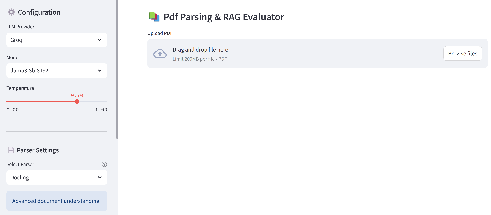

<div align="center">
<a href="https://www.instagram.com/genieincodebottle/"></a>
</div>
<br>

<div align="center">
    <a target="_blank" href="https://www.youtube.com/@genieincodebottle"></a>&nbsp;
    <a target="_blank" href="https://www.linkedin.com/in/rajesh-srivastava"></a>&nbsp;
    <a target="_blank" href="https://www.instagram.com/genieincodebottle/"></a>&nbsp;
    <a target="_blank" href="https://github.com/genieincodebottle/generative-ai/blob/main/GenAI_Roadmap.md"></a>
</div>

## A. 🖼️ [OCR with Multimodal | Vision Language Models](/vlm_ocr/)

## B. 📑 Complex PDF Parsing

A Comprehensive example codes for extracting content from complex PDFs with mixed elements, including text and image data extraction

Also, check -> [Pdf Parsing Guide](https://github.com/genieincodebottle/parse-my-pdf/blob/main/pdf-parsing-guide.pdf)

### 📦 Implementation Options

#### 1. ☁️ Paid - API Based Methods

| Model Provider | Models                      | Details                                 | Example Code     | Doc       |
| -------------- | ----------------------------|-------------------------------- | -------- |---------- |
| Anthropic      | `claude-3-7-sonnet-20250219`, `claude-3-5-sonnet-20241022`| Claude 3.7/3.5 Sonnet is a multimodal AI model developed by Anthropic, capable of processing both text and images. It excels in visual reasoning tasks, such as interpreting charts and graphs, and can accurately transcribe text from imperfect images, benefiting industries like retail, logistics, and financial services.  | [Code](/parser/claude/)              | [Doc](https://www.anthropic.com/claude/)
| Gemini         | `gemini-2.0-flash`, `gemini-2.0-flash-lite`, `gemini-2.0-pro-exp-02-05` | ​Gemini 2.0 Flash is offering superior speed, native tool integration, and multimodal generation capabilities. It supports a 1 million token context window, enabling efficient processing of extensive data. The model accepts multimodal inputs—including text, images, audio, and video—and provides multimodal outputs, such as natively generated images and controllable text-to-speech audio.| [Code](/parser/gemini/)              | [Doc](https://ai.google.dev/gemini-api/docs/models)
| OpenAI         | `gpt-4o`, `gpt-4o-mini` | GPT-4o is a multimodal AI model capable of processing text, images, and audio with high efficiency. It enhances text generation, reasoning, and vision tasks while improving latency and cost. Supporting multiple languages, it enables real-time interactions and advanced multimodal applications. | [Code](/parser/openai/)              | [Doc](https://platform.openai.com/docs/models/gpt-4o)
| Mistral-OCR        | `mistral-ocr` | Mistral OCR is an advanced AI-powered OCR API for extracting structured text, tables, and equations from documents with high accuracy. It supports multiple languages, processes up to 2,000 pages/min, and provides structured markdown output. Available via Mistral’s platform with flexible deployment options.  | [Code](/parser/mistral_ocr/)              | [Doc](https://mistral.ai/news/mistral-ocr)
| Unstructure IO      | -- | Advanced content partitioning and classification. Unstructured.io specializes in converting unstructured data for LLMs and AI applications. Its open-source Unstructured library processes PDFs, HTML, Word, and images, streamlining data prep for AI. The Enterprise ETL Platform automates data ingestion and cleaning, integrating seamlessly with Generative AI stacks.  | [Code](/parser/unstructured-io/)  | [Doc](https://docs.unstructured.io/welcome)
| Llama-Parse     | -- | LlamaParse is a GenAI-native document parser for LLM applications like RAG and agents. It supports PDFs, PowerPoint, Word, Excel, and HTML, accurately extracting tables, images, and diagrams. It integrates with LlamaIndex for retrieval systems and allows custom parsing via prompts. Free users get 1,000 pages/day, with paid plans offering higher limits and extra features. | [Code](/parser/llama-parse/)  | [Doc](https://docs.llamaindex.ai/en/stable/llama_cloud/llama_parse/)
| Amazon Textract     | -- | Advanced content partitioning and classification. Amazon Textract is an AWS ML service that extracts text, forms, tables, and signatures from scanned documents. It goes beyond OCR by preserving structure for easy data integration. Supporting PNG, JPEG, TIFF, and PDF, it enables automation for data entry, search indexing, and document processing. | [Code](/parser/amazon-textract/)  | [Doc](https://aws.amazon.com/textract/)


#### 2. 🖥️ Open Weight - Local Methods

| Model/Framework Provider | Models/Framework Name                     | Details                                 | Example Code     | Doc       |
| -------------- | ----------------------------|-------------------------------- | ------------------ | ----------| 
| Meta      | `llama3.2-vision`| ​Llama 3.2-11B Vision is a multimodal AI model developed by Meta, designed to process both text and images. It excels in visual recognition, image reasoning, captioning, and answering general questions about images. With a context length of 128,000 tokens, it supports complex multimodal interactions. The model is optimized for efficiency, making it suitable for deployment on various platforms, including mobile devices. | [Code](/parser/llama-vision/) | [Doc](https://ai.meta.com/blog/llama-3-2-connect-2024-vision-edge-mobile-devices)  
| IBM      | `Docling`| Excellent  for complex PDFs with mixed content. Docling simplifies document processing, parsing diverse formats — including advanced PDF understanding, and providing seamless integrations with the gen AI ecosystem. | [Code](/parser/docling/) | [Doc](https://docling-project.github.io/docling/)  
| Microsoft      | `markitdown`| Excellent  for complex PDFs with mixed content. MarkItDown is a utility for converting various files to Markdown (e.g., for indexing, text analysis, etc). It supports: PDF, PowerPoint, Word, Excel, Images (EXIF metadata and OCR), Audio (EXIF metadata and speech transcription), HTML, Text-based formats (CSV, JSON, XML), ZIP files (iterates over contents). | [Code](/parser/markitdown/) | [Doc](https://github.com/microsoft/markitdown)  
| --     | `marker`| Marker quickly converts PDFs and images to Markdown, JSON, and HTML with high accuracy. It supports all languages and document types while handling tables, forms, math, links, and code blocks. It extracts images, removes artifacts, and allows customization with user-defined formatting and logic. Accuracy can be enhanced with LLM integration, and it runs on GPU, CPU, or MPS. Code is not included here but can be checked on their GitHub repo.  | [Code](https://github.com/VikParuchuri/marker?tab=readme-ov-file#installation) | [Doc](https://github.com/VikParuchuri/marker)  
| Camelot-Dev      | `Camelot`| Specialized table extraction. Camelot is a Python library for extracting tables from text-based PDFs using "Lattice" (grid-based) and "Stream" (whitespace-based) methods. It outputs tables as pandas DataFrames and supports CSV, JSON, Excel, and more. A CLI is available, and Excalibur provides a web-based interface for easy table extraction.  | [Code](/parser/camelot/) | [Doc](https://github.com/camelot-dev/camelot)  
| PyPdf     | `PyPdf`| pypdf is a free and open-source pure-python PDF library capable of splitting, merging, cropping, and transforming the pages of PDF files. It can also add custom data, viewing options, and passwords to PDF files. pypdf can retrieve text and metadata from PDFs as well.  | [Code](/parser/pypdf/) | [Doc](https://pypdf.readthedocs.io/en/stable/)  
| PDFMiner     | `PDFMiner`| Basic text and layout extraction. PDFMiner is a Python library for extracting text and layout details from PDFs, supporting various fonts and complex layouts. It enables conversion to HTML/XML and automatic layout analysis. Since version 20191010, it supports only Python 3, with pdfminer.six available for Python 2.  | [Code](/parser/pdfminer/) | [Doc](https://pdfminersix.readthedocs.io/en/latest/)  
| Artifex Software    | `PyMUPDF`| PyMuPDF is a fast Python library for extracting, analyzing, converting, and manipulating PDFs, XPS, and eBooks. It supports text/image extraction, rendering to PNG/SVG, and conversion to HTML, XML, and JSON, making it ideal for high-speed document processing.  | [Code](/parser/pymupdf/) | [Doc](https://pymupdf.readthedocs.io/en/latest/)  
| Google    | `pdfium`| PDFium is Google's open-source C++ library for viewing, parsing, and rendering PDFs. It powers Chromium, enabling text extraction, metadata access, and page rendering. Designed for performance, it's ideal for desktop and server applications.  | [Code](/parser/pypdfium/) | [Doc](https://pdfium.googlesource.com/pdfium/)  
| LangChain    | `PyPdfDirectory`| Batch PDF Content Extraction Script using PyPDF2 Directory Loader.  | [Code](/parser/pypdfdirectory/) | [Doc](https://python.langchain.com/api_reference/community/document_loaders/langchain_community.document_loaders.pdf.PyPDFDirectoryLoader.html)  
| --    | `PDFPlumber`| Basic text and layout extraction. PDFPlumber extends pdfminer.six for PDF data extraction, handling text, tables, and shapes with visual debugging. It excels at extracting tables into pandas DataFrames while preserving layout but lacks OCR for scanned documents.  | [Code](/parser/pdfplumber/) | [Doc](https://github.com/jsvine/pdfplumber)  

### 🔗 Dependencies

#### 📚 Python Libraries
```bash
# UI
streamlit>=1.43.2 

# PDF Processing Libraries
pypdf>=5.4.0
pymupdf>=1.25.4
PyPDF2>=3.0
camelot-py>=1.0.0
Ghostscript>=0.7

docling>=2.26.0 # IBM's Opensource
markitdown>=0.0.2 # Microsoft's Opensource
llama-cloud-services>=0.1.14 #llama-parse related 

# Computer Vision
opencv-python>=4.11.0.86

# LLM related Libraries
ollama>=0.4.7
openai>=1.66.3
anthropic>=0.49.0
langchain_ollama>=0.2.3
langchain-groq>=0.2.5
langchain_openai>=0.3.9
langchain-anthropic>=0.3.10
langchain-google-genai>=2.1.0
langchain-unstructured>=0.1.6
langchain_huggingface>=0.1.2
langchain_community>=0.3.19
tiktoken>=0.9.0
google-genai>=1.5.0

# Huggingface library
transformers>=4.49.0

# Vector Store and Embeddings
faiss-cpu>=1.10.0
sentence_transformers>=3.4.1

# AWS Libraries
boto3>=1.37.14
amazon-textract-caller>=0.2.0

# Utilities
nest-asyncio>=1.6.0
python-dotenv>=1.0.1
```

### ⚙️ Setup Instructions

- #### Prerequisites
   - Python 3.9 or higher
   - pip (Python package installer)

- #### Installation
   1. Clone the repository:
      ```bash
      git clone https://github.com/genieincodebottle/parsemypdf.git
      cd parsemypdf
      ```
   2. Create a virtual environment:
      ```bash
      python -m venv venv
      venv\Scripts\activate # On Linux -> source venv/bin/activate
      ```
   3. Install dependencies:
      ```bash
      pip install -r requirements.txt
      ```
   4. Rename `.env.example` to `.env` and update required Environment Variables as per requirements
      ```bash
      GROQ_API_KEY=your_key_here    # For Groq based open source models
      ANTHROPIC_API_KEY=your_key_here    # For Claude
      OPENAI_API_KEY=your_key_here       # For OpenAI
      GOOGLE_API_KEY=your_key_here   # For Google's Gemini models api key
      UNSTRUCTURED_API_KEY=your_key_here # For Unstructured.io
      LLAMA_CLOUD_API_KEY=your_key_here # For llama-parse
      MISTRAL_API_KEY=your_key_here # For Mistral API Key
      OMNI_API_KEY=your_key_here # For Omniai API Key
      ```

      For **GROQ_API_KEY** follow this -> https://console.groq.com/keys

      For **ANTHROPIC_API_KEY** follow this -> https://console.anthropic.com/settings/keys

      For **OPENAI_API_KEY** follow this -> https://platform.openai.com/api-keys

      For **GOOGLE_API_KEY** follow this -> https://ai.google.dev/gemini-api/docs/api-key

      For **UNSTRUCTURED_API_KEY** follow this -> https://unstructured.io/api-key-free

      For **LLAMA_CLOUD_API_KEY** follow this -> https://cloud.llamaindex.ai/api-key

      For **MISTRAL_API_KEY** follow this -> https://console.mistral.ai/api-keys

      For **OMNI_API_KEY** follow this -> https://app.getomni.ai/settings/account

  5. Install Ollama & Models (for local processing)
      - Install Ollama
         - For Window - Download the Ollama from following location (Requires Window 10 or later) -> https://ollama.com/download/windows
         - For Linux (command line) - curl https://ollama.ai/install.sh | sh

      - Pull required models (command line)
         - ollama pull llama3.1
         - ollama pull x/llama3.2-vision:11b

  6. For running each parser individually
      - Place PDF files in `input/` directory
      - You can run and test different type of parser available in "parser" folder.

  7. Example Complex Pdf placed in Input folder(You can use your own pdf)
      - **sample-1.pdf**: Standard tables
      - **sample-2.pdf**: Image-based simple tables
      - **sample-3.pdf**: Image-based complex tables
      - **sample-4.pdf**: Mixed content (text, tables, images)
      - **sample-5.pdf**: Multi-column Texts 
  
  8. To check all parsers at Web UI, run following command at "parsemypdf" folder
      -  streamlit run pdf_parser_app.py

      

  
### 📝 Important Notes
- System resources needed for local Multimodal models operations
- API keys required for API/cloud based implementations
- Factor in PDF complexity—snapshots, tables, merged cells, scanned documents, handwritten text, multi-column layouts, rotated text, embedded images, and annotations—when selecting implementation options 
- All frameworks, libraries, and multimodal models provided in one place for testing. 
- Ghostscript required for Camelot
